# Claude Code Workflows & Agents

A comprehensive production-ready system combining **specialized AI agents**, **multi-agent workflow orchestrators**, and **development tools** for [Claude Code](https://docs.anthropic.com/en/docs/claude-code).

## Overview

This unified repository provides everything needed for intelligent automation and multi-agent orchestration across modern software development:

- **5 Specialized Agents** - Domain experts with deep knowledge across architecture, languages, infrastructure, quality, data/AI, documentation, business operations, and SEO
- **1 Workflow Orchestrators** - Multi-agent coordination systems for complex operations like full-stack development, security hardening, ML pipelines, and incident response
- **3 Development Tools** - Focused utilities for specific tasks including API scaffolding, security scanning, test automation, and infrastructure setup

## Installation

Add this marketplace to Claude Code:

```bash
/plugin marketplace add https://github.com/bodis/agents
```

Then browse and install plugins using:

```bash
/plugin
```

### Available Plugins

#### Getting Started

**mvp-dev-stack** - MVP Development Stack (Python, React&Next.js, Supabase)
```bash
/plugin install mvp-dev-stack
```

[documentation about the stack](documentations/mvp-development-plugin.md)

## MVP Stack & Agentic Workflow

### Tech Stack
The MVP Development Stack consists of:
- **Backend**: Python/FastAPI with Pydantic v2
- **Frontend**: React/Next.js with TypeScript & shadcn/ui
- **Database**: Supabase (PostgreSQL with RLS)
- **API Design**: OpenAPI 3.0.0 specification-first
- **Deployment**: GCP (Cloud Run + Cloud Storage)

### API-First Agentic Development Flow

```mermaid
flowchart TD
    Start([User Request]) --> Orchestrator[implementation-orchestrator<br/>Workflow Conductor]

    Orchestrator --> DB[1. supabase-architect<br/>Database Schema]
    DB --> DBFiles[Creates:<br/>•supabase/migrations/*.sql<br/>•docs/database/README.md]

    DBFiles --> API[2. api-designer<br/>API Contracts]
    API --> APIFiles[Creates:<br/>•docs/openapi.yaml<br/>•REST + SSE specs]

    APIFiles --> Backend[3. backend-developer<br/>FastAPI Implementation]
    Backend --> BackendFiles[Creates:<br/>•backend/src/**/*.py<br/>•Services & endpoints]

    APIFiles --> Frontend[4. frontend-developer<br/>React/Next.js UI]
    Frontend --> FrontendFiles[Creates:<br/>•frontend/src/**/*<br/>•Components & hooks]

    BackendFiles --> Tests[5. test-engineer<br/>Test Suites]
    FrontendFiles --> Tests
    Tests --> TestFiles[Creates:<br/>•backend/tests/**<br/>•frontend/tests/**<br/>•e2e/**]

    TestFiles --> Review[6. code-reviewer<br/>Quality Gate]
    Review --> Complete([Feature Complete])

    style Orchestrator fill:#3b3b3b,stroke-width:4px
    style DB fill:#3b3b3b,stroke-width:4px
    style API fill:#3b3b3b,stroke-width:4px
    style Backend fill:#3b3b3b,stroke-width:4px
    style Frontend fill:#3b3b3b,stroke-width:4px
    style Tests fill:#3b3b3b,stroke-width:4px
    style Review fill:#3b3b3b,stroke-width:4px
    style Complete fill:#3b3b3b,stroke-width:4px
```



**Key Principles:**
- **Sequential Flow**: Each step depends on the previous one
- **Clear Ownership**: Agents can only modify their designated files
- **API-First**: Database → API Spec → Implementation → Testing
- **Separation of Concerns**: Each agent has a focused responsibility

### Example: Building a Notification System

```
👤 User Request: "Add notifications with real-time updates"

┌──────────────────────────────────────────────────────┐
│         🎯 implementation-orchestrator               │
│              Analyzes & Plans Execution              │
└────────────────┬─────────────────────────────────────┘
                 │
Step 1 ──────────▼─────────────────────────────────────┐
│ 🗄️ supabase-architect                                │
│ Task: Create notifications table with RLS            │
│ ✅ Output: supabase/migrations/001_notifications.sql │
│           docs/database/README.md updated            │
└──────────────────────────────────────────────────────┘
                 │
Step 2 ──────────▼─────────────────────────────────────┐
│ 📝 api-designer                                      │
│ Task: Define REST endpoints + SSE stream             │
│ ✅ Output: docs/openapi.yaml with:                   │
│           POST /api/notifications                    │
│           GET /api/stream/notifications              │
└──────────────────────────────────────────────────────┘
                 │
Step 3 ──────────▼─────────────────────────────────────┐
│ ⚙️ backend-developer                                 │
│ Task: Implement FastAPI notification service         │
│ ✅ Output: backend/src/services/notifications.py     │
│           backend/src/api/v1/notifications.py        │
└──────────────────────────────────────────────────────┘
                 │
Step 4 ──────────▼─────────────────────────────────────┐
│ 🎨 frontend-developer                                │
│ Task: Build notification UI components               │
│ ✅ Output: frontend/src/components/NotificationBell  │
│           frontend/src/hooks/useNotifications        │
└──────────────────────────────────────────────────────┘
                 │
Step 5 ──────────▼─────────────────────────────────────┐
│ 🧪 test-engineer                                     │
│ Task: Write comprehensive test suite                 │
│ ✅ Output: backend/tests/test_notifications.py       │
│           e2e/notifications.spec.ts                  │
└──────────────────────────────────────────────────────┘
                 │
Step 6 ──────────▼─────────────────────────────────────┐
│ 🔍 code-reviewer                                     │
│ Task: Security audit & quality check                 │
│ ✅ Output: Approval with feedback                    │
└──────────────────────────────────────────────────────┘
                 │
                 ▼
         ✅ Feature Complete
```

## Agent Categories

### xxxx

## Contributing

To add new agents, workflows, or tools:

1. Create a new `.md` file in the appropriate directory with frontmatter
2. Use lowercase, hyphen-separated naming convention
3. Write clear activation criteria in the description
4. Define comprehensive system prompt with expertise areas

### Subagent Format

Each subagent is defined as a Markdown file with frontmatter:

```markdown
---
name: subagent-name
description: Activation criteria for this subagent
model: haiku|sonnet|opus  # Optional: Model selection
tools: tool1, tool2       # Optional: Tool restrictions
---

System prompt defining the subagent's expertise and behavior
```

### Model Selection Criteria

- **haiku**: Simple, deterministic tasks with minimal reasoning
- **sonnet**: Standard development and engineering tasks
- **opus**: Complex analysis, architecture, and critical operations

## License

MIT License - see [LICENSE](LICENSE) file for details.

## Resources

- [Claude Code Documentation](https://docs.anthropic.com/en/docs/claude-code)
- [Subagents Documentation](https://docs.anthropic.com/en/docs/claude-code/sub-agents)
- [Claude Code GitHub](https://github.com/anthropics/claude-code)