# Claude Code Workflows & Agents

A comprehensive production-ready system combining **specialized AI agents**, **multi-agent workflow orchestrators**, and **development tools** for [Claude Code](https://docs.anthropic.com/en/docs/claude-code).

## Overview

This unified repository provides everything needed for intelligent automation and multi-agent orchestration across modern software development:

- **9 Specialized Agents** - Domain experts with deep knowledge across database architecture, API design, backend/frontend development, testing, code review, DevOps, documentation, and Speckit management
- **1 Workflow Orchestrator** - Multi-agent coordination system for API-first full-stack development with proper task sequencing and delegation
- **Development Tools** - Focused utilities for specific tasks including API scaffolding, security scanning, test automation, and infrastructure setup

## Installation

Add this marketplace to Claude Code:

```bash
/plugin marketplace add https://github.com/bodis/agents
```

Then browse and install plugins using:

```bash
/plugin
```

### Available Plugins

#### Getting Started

**mvp-dev-stack** - MVP Development Stack (Python, React&Next.js, Supabase)
```bash
/plugin install mvp-dev-stack
```

[documentation about the stack](documentations/mvp-development-plugin.md)

## MVP Stack & Agentic Workflow

### Tech Stack
The MVP Development Stack consists of:
- **Backend**: Python/FastAPI with Pydantic v2
- **Frontend**: React/Next.js with TypeScript & shadcn/ui
- **Database**: Supabase (PostgreSQL with RLS)
- **API Design**: OpenAPI 3.0.0 specification-first
- **Deployment**: GCP (Cloud Run + Cloud Storage)

### API-First Agentic Development Flow

```mermaid
flowchart TD
    Start([User Request]) --> Orchestrator[implementation-orchestrator<br/>Delegates Only - No File Modifications]

    Orchestrator --> DB[1. supabase-architect<br/>Database Schema]
    DB --> DBFiles[Creates:<br/>•supabase/migrations/*.sql<br/>•docs/database/README.md]

    DBFiles --> API[2. api-designer<br/>API Contracts]
    API --> APIFiles[Creates:<br/>•docs/openapi.yaml<br/>•REST + SSE specs]

    APIFiles --> Backend[3. backend-developer<br/>FastAPI Implementation]
    Backend --> BackendFiles[Creates:<br/>•backend/src/**/*.py<br/>•Services & endpoints]

    APIFiles --> Frontend[4. frontend-developer<br/>React/Next.js UI]
    Frontend --> FrontendFiles[Creates:<br/>•frontend/src/**/*<br/>•Components & hooks]

    BackendFiles --> Tests[5. test-engineer<br/>Test Suites]
    FrontendFiles --> Tests
    Tests --> TestFiles[Creates:<br/>•backend/tests/**<br/>•frontend/tests/**<br/>•e2e/**]

    TestFiles --> Review[6. code-reviewer<br/>Quality Gate]
    Review --> Docs[7. documentation-writer<br/>Documentation Updates]
    Docs --> DocsFiles[Updates:<br/>•README.md<br/>•CLAUDE.md if relevant<br/>•docs/documentation.md]

    DocsFiles --> Speckit[8. speckit-manager<br/>Status Updates]
    Speckit --> SpeckitFiles[Updates:<br/>•specs/**/* task status<br/>Only if Speckit exists]

    SpeckitFiles --> Complete([Feature Complete])

    style Orchestrator fill:#3b3b3b,stroke-width:4px
    style DB fill:#3b3b3b,stroke-width:4px
    style API fill:#3b3b3b,stroke-width:4px
    style Backend fill:#3b3b3b,stroke-width:4px
    style Frontend fill:#3b3b3b,stroke-width:4px
    style Tests fill:#3b3b3b,stroke-width:4px
    style Review fill:#3b3b3b,stroke-width:4px
    style Docs fill:#3b3b3b,stroke-width:4px
    style Speckit fill:#3b3b3b,stroke-width:4px
    style Complete fill:#3b3b3b,stroke-width:4px
```



**Key Principles:**
- **Sequential Flow**: Each step depends on the previous one - no parallel execution
- **Orchestrator Delegates Only**: implementation-orchestrator cannot modify any files, only coordinates other agents
- **Clear Ownership**: Each agent can only modify their designated files
- **API-First**: Database → API Spec → Implementation → Testing → Documentation → Status Updates
- **Separation of Concerns**: Each agent has a single, focused responsibility
- **Documentation Last**: documentation-writer runs after implementation to update docs and CLAUDE.md if relevant
- **Status Management**: speckit-manager runs last to update task completion status (if Speckit exists)

### Example: Building a Notification System

```
👤 User Request: "Add notifications with real-time updates"

┌──────────────────────────────────────────────────────┐
│         🎯 implementation-orchestrator               │
│         Coordinates & Delegates (No File Edits)      │
└────────────────┬─────────────────────────────────────┘
                 │
Step 1 ──────────▼─────────────────────────────────────┐
│ 🗄️ supabase-architect                                │
│ Task: Create notifications table with RLS            │
│ ✅ Output: supabase/migrations/001_notifications.sql │
│           docs/database/README.md updated            │
└──────────────────────────────────────────────────────┘
                 │
Step 2 ──────────▼─────────────────────────────────────┐
│ 📝 api-designer                                      │
│ Task: Define REST endpoints + SSE stream             │
│ ✅ Output: docs/openapi.yaml with:                   │
│           POST /api/notifications                    │
│           GET /api/stream/notifications              │
└──────────────────────────────────────────────────────┘
                 │
Step 3 ──────────▼─────────────────────────────────────┐
│ ⚙️ backend-developer                                 │
│ Task: Implement FastAPI notification service         │
│ ✅ Output: backend/src/services/notifications.py     │
│           backend/src/api/v1/notifications.py        │
└──────────────────────────────────────────────────────┘
                 │
Step 4 ──────────▼─────────────────────────────────────┐
│ 🎨 frontend-developer                                │
│ Task: Build notification UI components               │
│ ✅ Output: frontend/src/components/NotificationBell  │
│           frontend/src/hooks/useNotifications        │
└──────────────────────────────────────────────────────┘
                 │
Step 5 ──────────▼─────────────────────────────────────┐
│ 🧪 test-engineer                                     │
│ Task: Write comprehensive test suite                 │
│ ✅ Output: backend/tests/test_notifications.py       │
│           e2e/notifications.spec.ts                  │
└──────────────────────────────────────────────────────┘
                 │
Step 6 ──────────▼─────────────────────────────────────┐
│ 🔍 code-reviewer                                     │
│ Task: Security audit & quality check                 │
│ ✅ Output: Approval with feedback                    │
└──────────────────────────────────────────────────────┘
                 │
Step 7 ──────────▼─────────────────────────────────────┐
│ 📚 documentation-writer                              │
│ Task: Update project documentation                   │
│ ✅ Output: docs/documentation.md updated             │
│           CLAUDE.md updated (SSE pattern added)      │
│           README.md (no changes needed)              │
└──────────────────────────────────────────────────────┘
                 │
Step 8 ──────────▼─────────────────────────────────────┐
│ ✓ speckit-manager                                    │
│ Task: Update Speckit task completion status          │
│ ✅ Output: specs/notifications/tasks/* marked done   │
│           specs/notifications/plan.md updated        │
└──────────────────────────────────────────────────────┘
                 │
                 ▼
         ✅ Feature Complete
```

## Agent Categories

### Workflow Coordination

**implementation-orchestrator**
- **Role**: Workflow coordinator and task delegator
- **Capabilities**: Plans execution, sequences tasks, delegates to specialized agents
- **Critical**: Cannot modify any files - only coordinates and delegates
- **Tools**: Read, Bash, Grep, Glob, TodoWrite
- **Activates**: When implementing complete features or multi-step tasks

### Database Layer

**supabase-architect**
- **Role**: Database schema designer and migration manager
- **Capabilities**: Creates migrations, manages RLS policies, generates TypeScript types
- **Modifies**: `supabase/migrations/*`, `docs/database/README.md`, `docs/datamodel.md`
- **Tools**: Read, Write, Edit, Bash, Grep, Glob
- **Activates**: For database structure changes, migrations, RLS policies

### API Design Layer

**api-designer**
- **Role**: OpenAPI 3.0.0 specification specialist
- **Capabilities**: Defines REST and SSE endpoint contracts, documents request/response schemas
- **Modifies**: `docs/openapi.yaml`
- **Tools**: Read, Write, Edit, Bash, Grep, Glob
- **Activates**: For API endpoint design, documentation, contract definition

### Implementation Layer

**backend-developer**
- **Role**: Python FastAPI implementation specialist
- **Capabilities**: Implements FastAPI endpoints, creates services and business logic, integrates with Supabase
- **Modifies**: `backend/src/**/*.py`
- **Tools**: Read, Write, Edit, Bash, Grep, Glob
- **Activates**: For Python/FastAPI code, API implementation, business logic

**frontend-developer**
- **Role**: React/Next.js UI specialist
- **Capabilities**: Builds React components, implements forms with Zod validation, integrates with backend APIs
- **Modifies**: `frontend/src/**/*`
- **Tools**: Read, Write, Edit, Bash, Grep, Glob, Playwright
- **Activates**: For React components, UI/UX, client-side logic

### Quality & Testing Layer

**test-engineer**
- **Role**: Testing specialist for comprehensive test coverage
- **Capabilities**: Creates unit tests (mandatory for backend), integration tests, E2E tests
- **Modifies**: `backend/tests/**`, `frontend/tests/**`, `e2e/**`
- **Tools**: Read, Write, Bash, Playwright
- **Activates**: For all testing tasks, test debugging

**code-reviewer**
- **Role**: Code quality and security specialist
- **Capabilities**: Reviews code for security, checks adherence to patterns, final approval
- **Modifies**: None (read-only review)
- **Tools**: Read, Bash
- **Activates**: For final review before feature completion

### Infrastructure Layer

**devops-engineer**
- **Role**: DevOps and infrastructure specialist
- **Capabilities**: Sets up local development, configures CI/CD, manages Docker, handles deployments
- **Modifies**: `.github/workflows/*`, Docker configurations, deployment scripts
- **Tools**: Read, Write, Edit, Bash, Grep, Glob
- **Activates**: For environment setup, deployment, CI/CD tasks

### Documentation Layer

**documentation-writer**
- **Role**: Documentation maintenance specialist
- **Capabilities**: Updates README.md, CLAUDE.md (when relevant), docs/documentation.md
- **Critical**: ONLY agent that can modify CLAUDE.md
- **Modifies**: `README.md`, `CLAUDE.md`, `docs/documentation.md`, `docs/*.md`
- **Tools**: Read, Write, Edit, Bash, Grep, Glob
- **Activates**: After feature implementation for documentation updates

**speckit-manager**
- **Role**: Speckit task status manager
- **Capabilities**: Updates task completion status based on implementation results
- **Critical**: ONLY agent that can modify specs/ directory, runs LAST in workflow
- **Modifies**: `specs/**/*` (task status only)
- **Tools**: Read, Write, Edit, Bash, Grep, Glob
- **Activates**: After documentation-writer, only if Speckit content exists

## Plugin Development Best Practices

### Agent Naming & Delegation

**Rule**: When agents installed via plugin, they're prefixed (e.g., `plugin-name:agent-name`).

- ✅ Always use full prefixed names when delegating: `Task tool with subagent_type="plugin-name:agent-name"`
- ✅ Document full names in plugin README with a table
- ✅ Use prefixed names in all agent markdown files
- ❌ Never assume short names work between agents

### Agent Boundaries & Constraints

**Rule**: Define clear file ownership; prevent workarounds.

- ✅ Explicitly list which files each agent owns (can modify)
- ✅ Explicitly list which files each agent reads (cannot modify)
- ✅ Use tool restrictions to enforce boundaries
- ✅ Orchestrators should have NO file modification tools (Read, Bash, Grep, Glob, TodoWrite only)
- ✅ Document forbidden workarounds (e.g., bash pipes, echo redirection)
- ❌ Don't give agents escape hatches when delegation fails

### Documentation Dependencies

**Rule**: Single source of truth; clear ownership.

- ✅ Designate ONE agent owner per documentation file
- ✅ Document which agent maintains each file
- ✅ Define explicit read/write permissions
- ❌ Never duplicate documentation across files
- ❌ Never allow multiple agents to modify the same doc

### Workflow Enforcement

**Rule**: Define strict sequential phases with validation.

- ✅ Document required phase order
- ✅ Add pre-flight checks for dependencies
- ✅ Include validation steps in each phase
- ✅ Agents must STOP when dependencies missing
- ❌ Never skip phases
- ❌ Never proceed with assumptions or incomplete specs

### Error Handling

**Rule**: Fail fast; report clearly; never guess.

- ✅ Agents STOP immediately when blocked
- ✅ Report exact error with resolution steps
- ✅ Reference specific files/agents needed
- ❌ Never work around missing specifications
- ❌ Never assume or infer requirements

### Testing & Quality

**Rule**: Automate validation; make critical tests mandatory.

- ✅ Mark critical tests as mandatory (e.g., backend unit tests)
- ✅ Use hooks for auto-formatting (post_edit)
- ✅ Use hooks for validation (OpenAPI specs, TypeScript checks)
- ✅ Smart test runners (only run relevant tests)
- ❌ Don't skip validation steps
- ❌ Don't make all tests optional

### Speckit Integration

**Rule**: One agent owns specs/; runs last.

- ✅ Only speckit-manager modifies `specs/**/*`
- ✅ All other agents READ specs (never write)
- ✅ Speckit-manager runs LAST in workflow
- ❌ Never let implementation agents modify specs

## Contributing

To add new agents, workflows, or tools:

1. Create a new `.md` file in the appropriate directory with frontmatter
2. Use lowercase, hyphen-separated naming convention
3. Write clear activation criteria in the description
4. Define comprehensive system prompt with expertise areas

### Subagent Format

Each subagent is defined as a Markdown file with frontmatter:

```markdown
---
name: subagent-name
description: Activation criteria for this subagent
model: haiku|sonnet|opus  # Optional: Model selection
tools: tool1, tool2       # Optional: Tool restrictions
---

System prompt defining the subagent's expertise and behavior
```

### Model Selection Criteria

- **haiku**: Simple, deterministic tasks with minimal reasoning
- **sonnet**: Standard development and engineering tasks
- **opus**: Complex analysis, architecture, and critical operations

## License

MIT License - see [LICENSE](LICENSE) file for details.

## Resources

- [Claude Code Documentation](https://docs.anthropic.com/en/docs/claude-code)
- [Subagents Documentation](https://docs.anthropic.com/en/docs/claude-code/sub-agents)
- [Claude Code GitHub](https://github.com/anthropics/claude-code)